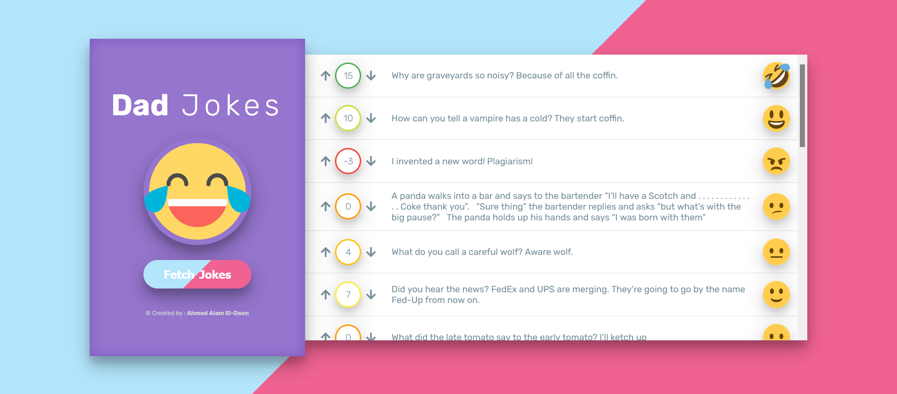

<div id="top"></div>


<!-- PROJECT LOGO -->
<div align="center">
  <br>
  <a href="https://modern-dad-jokes.vercel.app/">
      
    </a>
    <h1>Dad Jokes</h1>
  <p align="center">
  <a href="https://modern-dad-jokes.vercel.app/">View Demo</a>
    ·
    <a href="https://github.com/ahmedalam98/Dad-Jokes/issues">Report Bug</a>
  </p>
</div>

<!-- TABLE OF CONTENTS -->
<details>
  <summary>Table of Contents</summary>
  <ol>
    <li>
      <a href="#about-the-project">About The Project</a>
      <ul>
        <li><a href="#features">Features</a></li>
      </ul>
    </li>
    <li>
      <a href="#getting-started">Getting Started</a>
      <ul>
        <li><a href="#installation">Installation</a></li>
        <li><a href="#ports-and-endpoints">Ports and EndPoints</a></li>
      </ul>
    </li>
    <li><a href="#contributing">Contributing</a></li>
  </ol>
</details>

<!-- ABOUT THE PROJECT -->

## About The Project

React App that lets people view and vote on cheesy jokes from [icanhazdadjoke](https://icanhazdadjoke.com/) API



### Features

- List jokes fetched from [icanhazdadjoke](https://icanhazdadjoke.com/) API, along with:
  - "vot-up" Button
  - "vot-down" Button
  - net score for each joke
- User can vote and net score should update
- Should show loading state when loading jokes
- Should show the jokes sorted by net score, and update this as the scores changes on each fetch
- Should show dynamic vote-border-color and emoji based on joke net vote score
- Should persist the list of jokes in local storage
  - > When user visit the app, it should show saved jokes, rather than fetching new jokes, However the user should still be able to generate new jokes via the "New Jokes" button, and these new jokes should update the ones in local storage.

<p align="right">(<a href="#top">back to top</a>)</p>

---

## Getting Started

This project require some perquisites and dependencies to be installed, you can view it online using this [demo](https://modern-dad-jokes.vercel.app/). or you can find the instructions below:

> To get a local copy, follow these simple steps :

### Installation

#### installing Locally

1. Clone the repo

   ```sh
   git clone https://github.com/ahmedalam98/Dad-Jokes.git
   ```

2. go to project folder

   ```sh
   cd DAD-JOKES
   ```

3. install dependencies

   ```bash
   npm install --force
   ```

4. Run development server

   ```sh
   npm start
   ```

---

### Ports and EndPoints

#### Ports

- FrontEnd Development Server runs on port `3000`

#### API endpoints

- joke: [https://icanhazdadjoke.com/](https://icanhazdadjoke.com/) [GET]
  - headers: `"application/json"`

<p align="right">(<a href="#top">back to top</a>)</p>

---

<!-- CONTRIBUTING -->

## Contributing

Contributions are what make the open source community such an amazing place to learn, inspire, and create. Any contributions you make are **greatly appreciated**.

If you have a suggestion that would make this better, please fork the repo and create a pull request. You can also simply open an issue with the tag "enhancement".
Don't forget to give the project a star! Thanks!

1. Fork the Project
2. Create your Feature Branch (`git checkout -b feature/AmazingFeature`)
3. Commit your Changes (`git commit -m 'Add some AmazingFeature'`)
4. Push to the Branch (`git push origin feature/AmazingFeature`)
5. Open a Pull Request

<p align="right">(<a href="#top">back to top</a>)</p>
